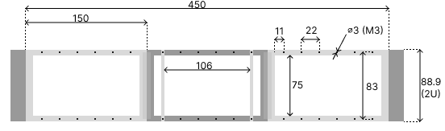
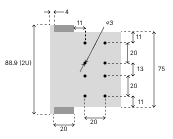

# micro-computer-server-cases
Server rack cases for micro computers like raspberry pi, nvidia jetson as well as storage cases.

The server rack case is divided into three equal parts. If the device you want to mount in the server rack 
case does not fit vertically you can mount it horizontally. See the diagrams for measurements when making your
own node cases.

## Standard size
### Raspberry pi
- [All models](https://www.raspberrypi.org/documentation/hardware/raspberrypi/mechanical/README.md)
- [pi 4](https://www.raspberrypi.org/documentation/hardware/raspberrypi/mechanical/rpi_MECH_4b_4p0.pdf)
- [pi 3b+](https://www.raspberrypi.org/documentation/hardware/raspberrypi/mechanical/rpi_MECH_3bplus.pdf)

### Nvidia jetson
- [Jetson nano developer kit](https://www.aetina.com/upload/User/images/AN110-NAO.jpg)

### Hard drive
- [HDD 3.5](https://www.overclock.net/photopost/data/823390/1/1a/1aec7c11_3_5_emount.jpeg)
- [SSD](https://www.intel.com/content/www/us/en/support/articles/000006346/memory-and-storage.html)

### Server case
- [Rack dimensions](https://upload.wikimedia.org/wikipedia/commons/thumb/0/08/19_inch_rack_dimensions.svg/767px-19_inch_rack_dimensions.svg.png)
19" 482.6mm
1.75" 44.45mm
